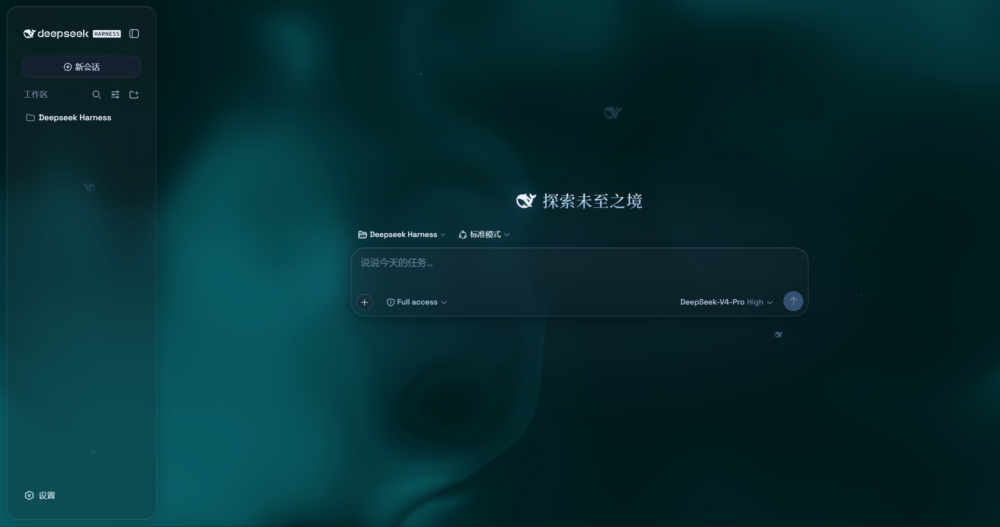
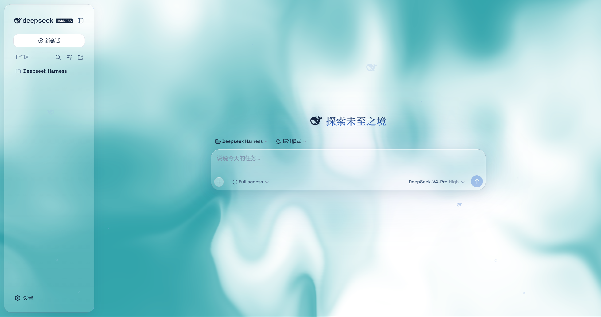
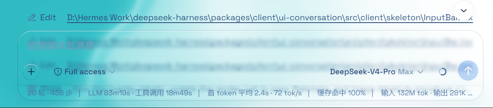
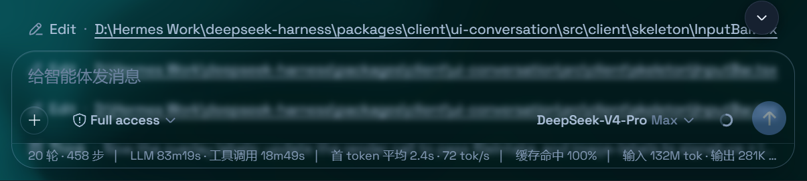

# @deepseek-ai/dsh-client-ui-aqua

## 本 README 在原作者**英文 README** 与**中文 README** 全文的基础上，于文末新增「**适配 0.1.1-rc.2**」一节，补充了针对新版 DeepSeek Harness 的 API 改动、我们做的修补，以及**推荐的安装方式**，建议跳转文末阅读。


# 原作者为WYH66666666,github：https://github.com/WYH66666666/DSH-Transparent-UI-Plugin

## 以下为原作者 README 原文

# @deepseek-ai/dsh-client-ui-aqua

English | [中文](README.zh.md)


Aqua is a highly customizable glassmorphism theme for the DeepSeek Harness web UI. The header, sidebar, composer, stats line, and trajectory view all become panes of frosted glass. you can put video for wallpaper and Switch it off and the stock UI comes back exactly, with no source changes to DSH itself.









## Features

- **Two modes**: **Mica** restyles the layout into floating glass cards (blur and frost adjustable), while **Compatibility Mode** keeps the stock layout byte-for-byte and only swaps the material to generic glass — other plugins' UI gets the same treatment automatically
- **Free backdrop**: a living fluid board (hue adjustable) or your own wallpaper (fills the page, aspect preserved, with its own blur and frost); light wallpapers look best in light mode, dark wallpapers in dark mode
- **Background brightness**: follows the resolved scheme — dark mode darkens (0–50), light mode brightens (50–100), 50 is unchanged
- **Particle whale**: the deepseek.com/harness centerpiece fish (a 2D port of the site's particle engine), centered in the chat area right of the sidebar — white particles on dark, gray on light, toggleable in settings
- **Glossy "Harness" badge**: in dark mode the sidebar wordmark wears the official nameplate pill (135° gradient ring + soft glow); light mode keeps the stock plate
- **Edge fades**: 5px gradient blur bands pinned to the top and bottom of the page, above the chat content — scrolling content melts into the edges; faint white veil on light, faint black on dark
- One switch: off restores the stock UI exactly, and every effect is removed with the plugin

## Installation

### Option 1: npm one-liner (recommended)

```sh
dsh plugin --profile web add dsh-client-ui-aqua
```

Installs the latest version from npm and registers it as a profile plugin layer (`dsh.bundle` patch) — works on every platform. Reload the web UI and it is on.

### Option 2: GitHub installer (fallback)

No npm account and no git needed (falls back to a plain zip download).

**Windows (one command):**

```powershell
powershell -ExecutionPolicy Bypass -Command "Invoke-WebRequest 'https://github.com/WYH66666666/DSH-Transparent-UI-Plugin/raw/main/install.ps1' -OutFile install.ps1; .\install.ps1"
```

Installs the **latest release** by default. The script links the plugin into the profile's `node_modules` and registers `ui-aqua` in `cordis.patch.yml` (idempotent — safe to run again).

Pin a version or track the dev branch:

```powershell
.\install.ps1 -Version 'v1.1.0'   # a specific release
.\install.ps1 -Version 'main'     # the development branch
```

**macOS / Linux (manual, three steps):**

```sh
git clone --depth 1 --branch v1.1.0 https://github.com/WYH66666666/DSH-Transparent-UI-Plugin.git
ln -s "$PWD/DSH" "$DSH_HOME/profiles/node_modules/@deepseek-ai/dsh-client-ui-aqua"
```

then append to `$DSH_HOME/profiles/web/cordis.patch.yml`:

```yaml
- insert:
    - id: ui-aqua
      name: '@deepseek-ai/dsh-client-ui-aqua'
```

## Usage

Reload the web UI. Aqua is **on by default**; the master switch lives in **Settings → Plugins → Glass theme** (same shape as the other plugin cards), and every other control sits directly under **Settings → General → Appearance** (no title of its own): mode, blur/frost (Mica mode), fluid color, background brightness, backdrop (fluid/wallpaper) with its wallpaper controls, and the particle-whale toggle. With the master switch off, the whole control block under Appearance is hidden.

---

## 原作者中文 README（原文）

# @deepseek-ai/dsh-client-ui-aqua

[English](README.md) | 中文


Aqua 是一层高自由度的玻璃质感主题，套在 DeepSeek Harness 网页端。顶栏、侧边栏、输入框、统计行、轨迹视图都成了磨砂玻璃片,你还可以添加视频和图片作为背景。关掉开关就回到原生界面，不改 DSH 任何一行源码。


## 特性

- **双模式**：**云母效果**把布局改成悬浮玻璃卡片（模糊度、磨砂度可调）；**兼容模式**保持原版排版一字不动，只把材质换成通用玻璃，其他插件的界面也会自动玻璃化
- **背景自由**：流体板（颜色可调）或自定义壁纸（铺满页面、比例不变，可单独调模糊度/磨砂度）；浅色壁纸配浅色模式、深色壁纸配深色模式观感更佳
- **背景亮度**：自动跟随深浅模式——深色模式 0–50 压暗、浅色模式 50–100 提亮，50 原样
- **粒子鲸鱼**：deepseek.com/harness 同款粒子鱼（官网粒子引擎移植），显示在聊天区域正中央（不含侧边栏），深色模式白粒子、浅色模式灰粒子，设置里可开关
- **Harness 光泽铭牌**：深色模式下侧边栏铭牌换成官网同款「Harness」药丸（135° 渐变描边 + 柔光），浅色模式保持原版铭牌
- **边缘渐变模糊**：页面顶部/底部各 5px 渐变模糊带，悬浮在聊天内容上层，内容滚到边缘渐入模糊；浅色微泛白、深色微泛黑
- 一键开关：关闭即完全还原原生界面，所有效果随插件卸载一并消失

## 安装

### 方式一：npm 一键安装（推荐）

```sh
dsh plugin --profile web add dsh-client-ui-aqua
```

从 npm 安装最新版，自动注册为 profile 插件层（`dsh.bundle` 补丁），所有平台通用。刷新 Web 界面即可。

### 方式二：GitHub 安装器（备用）

不需要 npm、不需要 git（自动退回 zip 下载）。

**Windows（一条命令）：**

```powershell
powershell -ExecutionPolicy Bypass -Command "Invoke-WebRequest 'https://github.com/WYH66666666/DSH-Transparent-UI-Plugin/raw/main/install.ps1' -OutFile install.ps1; .\install.ps1"
```

默认安装**最新发布版**。脚本会把插件链接进 profile 的 `node_modules`，并在 `cordis.patch.yml` 里登记 `ui-aqua`（幂等，重复跑不会重复登记）。

指定版本或跟随开发分支：

```powershell
.\install.ps1 -Version 'v1.1.0'   # 指定某个发布版
.\install.ps1 -Version 'main'     # 开发分支
```

**macOS / Linux（手动，三步）：**

```sh
git clone --depth 1 --branch v1.1.0 https://github.com/WYH66666666/DSH-Transparent-UI-Plugin.git
ln -s "$PWD/DSH" "$DSH_HOME/profiles/node_modules/@deepseek-ai/dsh-client-ui-aqua"
```

然后往 `$DSH_HOME/profiles/web/cordis.patch.yml` 追加：

```yaml
- insert:
    - id: ui-aqua
      name: '@deepseek-ai/dsh-client-ui-aqua'
```

## 使用

刷新 Web 界面。Aqua **默认开启**；总开关在 **设置 → 插件 → 玻璃主题**（形状与其他插件卡片一致），其余全部调节在 **设置 → 通用设置 → 外观** 的正下方（无独立标题）：模式、模糊度/磨砂度（云母模式）、流体颜色、背景亮度、背景（流体/壁纸）、壁纸设置，以及粒子鲸鱼开关。总开关关闭时，外观下方的整块调节自动隐藏。

---

# 以下为新增适配内容！！！

## 适配 0.1.1-rc.2（新增说明）

本分发包已针对 **DeepSeek Harness `0.1.1-rc.2`** 完成 API 适配，可直接安装使用。

### 原版不适配原因

`0.1.1-rc.2` 对客户端插件 API 做了破坏性变更（Theme / Store / Invariant / Locale 不变）：

1. **`settings.plugin.item` 槽位由 `list` 改为 `keyed`**：插件主卡片必须用 `key: 'settings.aqua'` 注册，不再用 `id` / `order`。
2. **「插件」配置页改为按 namespace 驱动**：必须调用 `ctx.settingsScope.bind({ namespace: 'settings.aqua' })`，否则 Aqua 主卡片不会出现在「插件」页。
3. **`ctx.slots.inject` 已移除**：改用 `ctx.effect(() => ctx.slots.register({...}, Comp), label)` 注册卡片与外观行。
4. **`settings.general.item` 仍是 `list`**：`id` / `order` 不变（外观调节行照旧）。

### 修改内容

- **还原 v1 预构建产物 `lib/`**（保留 `window.__ModuleLoader__.load(...)` 包裹格式与 CSS 内联注入），再对 `lib/client.js` 做**最小 API 修补**：
  - 注入服务数组加入 `"settingsScope"`；
  - `new AquaLayer(ctx)` 之后调用 `ctx.settingsScope.bind({ namespace: 'settings.aqua' })`；
  - 两处 `ctx.slots.inject(...)` 替换为 `ctx.effect(() => ctx.slots.register(...))`；
  - `settings.plugin.item` 用 `key: 'settings.aqua'`（去掉 `id` / `order`）；
  - `settings.general.item` 维持 `id: 'aqua', order: 11`。
- **`src/client/index.ts` 同步上述改动**，供未来在 monorepo 内用原厂预设重建。
- **新增独立构建 / 类型校验配置** `tsconfig.standalone.json` + `tsdown.standalone.config.ts`，可在 monorepo 之外做类型校验；`package.json` 加入 `@tsdown/css` 与 `overrides`（钉死 `tinyexec` / `@rolldown/pluginutils` 版本）以保证可复现。
- **全部玻璃质感功能与设置项原样保留**（磨砂/流体、壁纸模糊与柔光分离、亮度、粒子鲸鱼、mica / 兼容模式等）。

> 为什么不直接用 `tsdown` 重新构建 `client.js`？主机要求的 bundle 形态（CSS 内联注入）由 DSH 未对外发布的 client 构建预设产生；公开可用的 `@tsdown/css` 只会把 CSS 抽成独立的 `style.css` + `import`，主机无法识别。因此采用「还原 v1 预构建 + 最小 API 修补」的可靠路径。

### 兼容性验证

通过一份基于 mock 运行时的冒烟测试（`vm` 沙箱加载 `lib/client.js`，mock 一整套 DSH Web 运行时 + 浏览器 DOM，激活插件后断言新 API 表面）验证：

- `window.__ModuleLoader__.load` 包裹与内联 CSS 注入完整；
- `ctx.settingsScope.bind` 被调用且仅调用一次，`namespace === 'settings.aqua'`；
- `settings.plugin.item` 以 `key: 'settings.aqua'` 注册且无 `id`（list→keyed 迁移）；
- `settings.general.item` 仍为 `id: 'aqua', order: 11`。

全部断言通过。该验证脚本位于完整开发仓库的 `scripts/` 下，未纳入本精简分发包（不影响运行）。


# 推荐安装方式（本适配版）

由于原作者已在 README 中声明难以跟进 DSH API 更新，**npm 发布版仍未适配 `0.1.1-rc.2` 的旧版**；因此推荐直接安装**本文件夹（已适配的副本）**，而不是 `dsh plugin add` 拉取 npm 版。

**Windows（PowerShell，下载本仓库zip包后在本文件夹或任意目录执行；把路径改成你实际放置本文件夹的位置）：**

```powershell
powershell -ExecutionPolicy Bypass -Command ".\install.ps1 -Source '绝对路径\DSH-Transparent-UI-Plugin' -Profile web"
```

DSH 不在默认 `%USERPROFILE%\.dsh` 时，追加 `-DshHome '你的DSH路径'`。脚本会：① 取源码（本地路径直接链接，不走下载）；② 在 `profiles\node_modules\@deepseek-ai\dsh-client-ui-aqua` 建立 **junction 软链**（实时生效，之后在本文件夹里微调会直接反映到 DSH，无需重装）；③ 在 `profiles\web\cordis.patch.yml` 登记 `ui-aqua`（幂等，重复运行安全）。完成后**刷新 Web 界面**即可。

**macOS / Linux（手动三步）：**

```sh
ln -s "/绝对路径/DSH-Transparent-UI-Plugin" "$DSH_HOME/profiles/node_modules/@deepseek-ai/dsh-client-ui-aqua"
```

再往 `$DSH_HOME/profiles/web/cordis.patch.yml` 追加：

```yaml
- insert:
    - id: ui-aqua
      name: '@deepseek-ai/dsh-client-ui-aqua'
```

### 原作者提供的其他安装方式（仅供参考）

- **npm 一键**：`dsh plugin --profile web add dsh-client-ui-aqua`（可能拉到未适配新版 API 的旧版，谨慎使用）。
- **GitHub 安装器**：`powershell -ExecutionPolicy Bypass -Command "Invoke-WebRequest 'https://github.com/WYH66666666/DSH-Transparent-UI-Plugin/raw/main/install.ps1' -OutFile install.ps1; .\install.ps1"`（默认装最新发布版，可 `-Version` 指定版本或 `main` 分支）。

### 使用

刷新 Web 界面。Aqua **默认开启**：

- **总开关**：设置 → 插件 → 玻璃主题（卡片样式与其他插件一致）。
- **全部调节**：设置 → 通用设置 → 外观 正下方（无独立标题）—— 模式（云母/兼容）、模糊度/磨砂度、流体颜色、背景亮度、背景（流体/壁纸）、壁纸设置、粒子鲸鱼开关。总开关关闭时整块调节自动隐藏。

> 若刷新后「插件」页未出现 Aqua 卡片，重启 dsh web 进程后再试。
